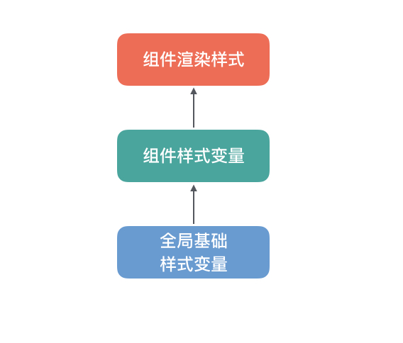

## 设计变量

<card>

### 基本介绍

设计变量是将组件样式当中的基础元素与具体业务产品的样式进行解耦，用以提供在设计规范和技术上的灵活样式自定义化，从而满足业务和品牌上多样化的视觉需求。

对于 mpx-cube-ui 组件的主题样式定制有个简单的逻辑关系：

* 全局基础样式变量：提供了基本色值、字号等，会影响到所有组件使用的样式；
* 组件样式变量：对于基本的色值、字号等继承于全局基础变量，涉及到组件自身的结构、样式变量会单独定义；
* 组件渲染样式：直接依赖组件样式变量；

通过定制**全局基础样式变量**和**组件样式变量**都能达到定制主题的目的，如果你的业务产品当中有明确的样式主题规范，那么更加推荐直接定制全局基础样式变量的方式。

当前文档可查阅全局基础样式变量，在每个组件文档底部的 `CSS Variable` 模块可以查阅每个组件所提供的所有可配置的组件样式变量。

</card>

<!-- @css-variable -> start -->

<card>

 ### color
|变量名|默认值|含义|
|---|---|---|
|$color-white|
#fff
|基础-白色|
|$color-black|
#323233
|基础-黑色|
|$color-primary|
#FF7E33
|基础-主要颜色|
|$color-secondary|
#4F5E83
|基础-次要颜色|
|$color-disabled|
#ccc
|基础-禁用色|
|$color-dark-grey|
#333
|基础-灰色|
|$color-dark-grey-s|
#323233
|基础-浅灰|
|$color-light-grey-opacity|
rgba(0, 0, 0, .04)
|基础-透明灰|
|$mask-bgc_opacity|
rgba(37, 38, 45, 0.4)
|遮罩层背景|
|$fill-bgc|
#f2f2f2
|基础-填充背景色|
|$opacity_active|
0.6
|基础-透明度|
|$text-color|
<a class="css-var-default" href="#color-black">$color-black</a>
|基础-正文、标题颜色|
|$text-color-desc|
#444
|基础-副标题、副文案、placeholder、提示性文字颜色|
|$text-color-hint|
#999
|基础-不希望显眼的文字（如“取消”文字按钮）颜色|
|$border-color-normal|
#ebebeb
|基础-1px边框颜色|

</card>

<card>

 ### size
|变量名|默认值|含义|
|---|---|---|
|$font-size-6xl|
30px
|-|
|$font-size-5xl|
28px
|-|
|$font-size-4xl|
26px
|-|
|$font-size-3xl|
24px
|-|
|$font-size-2xl|
22px
|-|
|$font-size-xl|
20px
|-|
|$font-size-lg|
18px
|-|
|$font-size-md|
16px
|-|
|$font-size-sm|
14px
|-|
|$font-size-xs|
12px
|-|
|$font-size-2xs|
10px
|-|

</card>

<!-- @css-variable -> end -->
