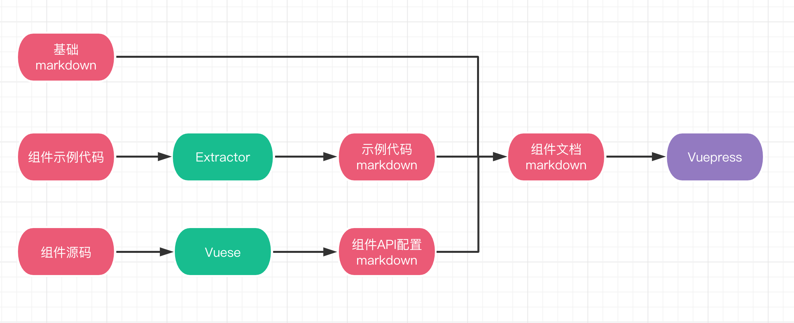

<card>

### 介绍

mpx-cube-ui 是基于 [Mpx 小程序框架](https://www.mpxjs.cn/)的移动端基础组件库，一份源码可以跨端输出所有小程序平台及 Web。

</card>

<card>

### 主题定制

mpx-cube-ui 提供了灵活配置的主题定制能力。

mpx-cube-ui 在组件设计开发阶段对于表现层的结构和样式进行抽离，利用预编译器和 CSS 变量的能力，提供细粒度（颜色、字体、圆角、阴影等）的样式定制能力，你的项目可以按需使用主题的编译方案还是运行时方案来满足不同样式风格的业务场景开发。

详见[主题与样式](http://localhost:8080/mpx-cube-ui/theme-passenger/guide/theme.html)章节。

</card>

<card>

### 跨端输出

mpx-cube-ui 提供了开箱即用的跨端输出能力。

mpx-cube-ui 的源码基于 Mpx 小程序框架进行开发，依托于 Mpx 提供的[跨平台能力](https://mpxjs.cn/articles/2.0.html#%E8%B7%A8%E5%B9%B3%E5%8F%B0%E5%BC%80%E5%8F%91)即基于微信小程序跨平台编译输出为支付宝、百度、QQ、头条等目标平台的小程序代码，同时还可以输出到 Web。所以 mpx-cube-ui 自然也就具备了跨端输出的能力。

除了 mpx-cube-ui 提供的组件外，基于微信小程序平台提供的原生组件在 Mpx 跨端能力的加持下，同样也可以在不同平台下输出功能较为一致的组件（不同小程序平台的规范会有一些差异）。

</card>

<card>

### 文档示例一体化

mpx-cube-ui 内置了文档示例一体化的能力。

这部分的功能极大的减少了我们维护文档示例的成本。未来这部分的能力会打包成独立的模块暴露出去，如果你的组件体系也是基于 Mpx（或 Vue）建设的那么可以尝试引入这部分的能力去快速搭建文档示例站点来降低文档、示例代码的维护成本。

</card>

<card>

### 官方生态

* [Mpx 小程序框架](https://mpxjs.cn/)
* [Mpx cli 脚手架](https://github.com/mpx-ecology/mpx-cli)
* [Mpx es check](https://github.com/mpx-ecology/mpx-es-check)
* [Mpx vscode 插件](https://github.com/mpx-ecology/vscode-mpx)
* [Mpxuse](https://github.com/mpx-ecology/mpxuse)

</card>

<card>

### 其他链接

* 意见反馈
* 更新日志
* 联系我们

</card>

<card>

### 参与贡献

如果你在使用 mpx-cube-ui 时遇到问题，或者想参与到项目建设当中来，欢迎给我们提 Issue 或 Pull Request

</card>
